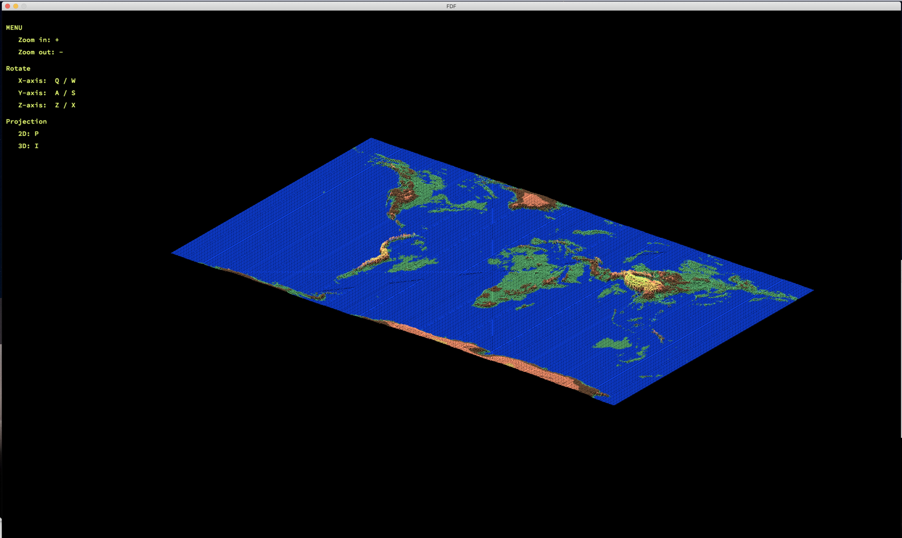
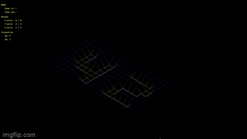

## 1. FdF

|   |   |
| - | - |
| Evaluated | 2021-12-10 |
| Stack | C |
| Domains | Computer Graphics, Algorithm |
| Topics | `Graphics` `Line Drawing Algorithm` `Isometic Projection` |
| English Subject | [en.subject](https://github.com/venera111/fdf/blob/master/en.subject.pdf) |




### 1.1 Rotation Matrix

In linear transformation, the rotation transformation matrix rotates any matrix around the origin. The rotational transformation matrix is one of the properties of linear transformation. The result of the rotation transformation for any coordinate can be obtained simply through the rotation transformation matrix.

### 1.2 Two-dimensional rotation transformation

Induction of the rotation transformation matrix around the origin.
Interpreting the relationship between P points and P'through analytical geometry and solving it using the addition theorem of trigonometric functions is as follows.

An example of obtaining the coordinates converted by rotation using the above expression is as follows.

Induction of a rotation transformation matrix centered at any point:

In the above case, it can be interpreted as rotating the backter in the direction of each point from the reference point. If you move the①,②, and ③ processes through the backter operation, the following is as follows:


### 1.3 Three-dimensional rotation transformation
Rotation transformation in three dimensions can be induced by looking at (x'y'z') if the coordinate axis (xyz) is rotated at any angle for any backter A.


The results of the analysis are as follows according to the principles of inner and inner spirit.


In the matrix formula below, the right-sided initial term can be arranged as a rotational transformation matrix. If you organize this through a trigonometric operation, the rotation transformation matrix for each axis is as follows.


Implementing this in code is as follows:
```C
static void	rotate_x(int *y, int *z, double alpha)
{
	int	prev_y;

	prev_y = *y;
	*y = prev_y * cos(alpha) + (*z) * sin(alpha);
	*z = -prev_y * sin(alpha) + (*z) * cos(alpha);
}

static void	rotate_y(int *x, int *z, double beta)
{
	int	prev_x;

	prev_x = *x;
	*x = prev_x * cos(beta) + (*z) * sin(beta);
	*z = -prev_x * sin(beta) + (*z) * cos(beta);
}

static void	rotate_z(int *x, int *y, double gamma)
{
	int	prev_x;
	int	prev_y;

	prev_x = *x;
	prev_y = *y;
	*x = prev_x * cos(gamma) - prev_y * sin(gamma);
	*y = prev_x * sin(gamma) + prev_y * cos(gamma);
}
```


## 2. Summary
The FdF project implements a simple wireframe graphical model that projects a curved terrain by connecting various points of a three-dimensional segment.

## 3. What I learned
The knowledge necessary for the projection of three-dimensional coordinates, such as the rotation transformation matrix, the linear interpolation method, the line drawing algorithm, the isometric projection method and the transformation of coordinates on the screen based on a certain point of view, were studied. He also mastered the basics of graphics programming.

## 4. Features
* Information about the coordinates and color of the terrain that will be projected using the implemented program is saved as a file and transmitted as a program parameter.
* When projecting segment points, use an isometric projection.

* The Bresenham algorithm is used to connect the points of segments.

* For pixels (coordinates) for which color information is not specified, the corresponding color is assigned using linear interpolation.

* When an error occurs while the program is running, the perror function outputs a corresponding error message.

* fdf uses the MiniLibX graphics library created by Ecole 42.

## 5. How to compile the project
The result of this project includes a Makefile. Makefile supports general rules (all, clean, fclean, re). After all the source codes are compiled, the ./fdf program is created.

## 6 How to execute the program
The fdf program receives the coordinates and color information of the terrain to be projected as a parameter of the program in file format.
> ./fdf test_maps/<map_file>

## Resources
Main: [ft_libgfx](https://github.com/qst0/ft_libgfx)
MiniLibX - Simple Graphical Interface Library for students: [qst0](https://qst0.github.io/ft_libgfx/man_mlx.html)
FDF Video: [Николай СФамилией](https://www.youtube.com/watch?v=10P59aOgi68)
42Docs: [harm-smits](https://harm-smits.github.io/42docs/)
Animation and Geometric Transformations: [OpenALG](https://alg.manifoldapp.org/read/computer-graphics-and-multimedia/section/7d42ae69-a732-4050-9a39-11d84e123b7e)
[42Seoul] cub3d/minirt - M1: [seomoon.log](https://velog.io/@seomoon/M1-%EB%A7%A5%EC%97%90%EC%84%9C-minilibX-%EC%8B%A4%ED%96%89%ED%95%98%EA%B8%B0-42-cub3dminiRT)
Основы трехмерного зрения: [Сергей Носов](https://delta-course.org/docs/delta7/Day8/Delta7D8L1.pdf)
42MapGenerator: [jgigault](https://github.com/jgigault/42MapGenerator)

